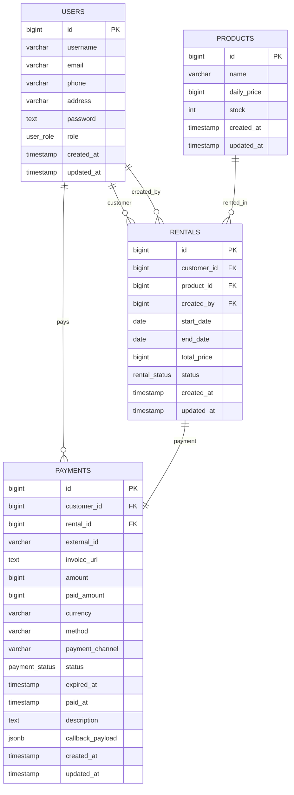

# Rentalin API

A simple rental management REST API built with Go.

This project was created for learning and portfolio purposes, focusing on backend development concepts such as authentication, authorization, database transactions, payment gateway integration, and clean application architecture.

Feel free to explore, use, and modify this project as part of your learning journey. Hope it helps and inspires you to build something awesome!

## Features

* JWT Authentication
* Role-Based Access Control
* User Management
* Product Management
* Rental Management
* Xendit Payment Integration
* Dashboard Statistics
* Structured Logging with Logrus

## Tech Stack

* Go (Golang)
* Echo
* PostgreSQL
* PGX
* JWT
* Logrus
* Xendit

## Database Schema (ERD)



## Getting Started

Clone the repository:

```bash
git clone https://github.com/yourusername/rentalin.git
cd rentalin
```

Copy the example environment file:

```bash
cp .env.example .env
```

Then update the values in `.env` according to your local environment.

> All required environment variables are already documented in `.env.example`.

Run the application:

```bash
go run cmd/server/main.go
```

The server will start on:

```text
http://localhost:8080
```

## API Collection

Postman collection is available in:

```text
docs/rentalin-api.postman_collection.json
```
